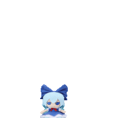

<h1 align="center">Hi there, I'm Adrian 👋</h1>
<h3 align="center">Junior Full Stack Developer | PHP | MySQL | React | Cloud Deployment</h3>

  
  

---

## 🚀 About Me

<table>
<tr>
  <td width="60%" valign="top">
  
  I am a **Junior Full Stack Developer** from the Philippines 🇵🇭.  
  I enjoy building **responsive web applications**, solving problems, and learning new technologies.  
  
  - 💻 Skilled in **PHP, MySQL, React, HTML, CSS, JavaScript**  
  - 🌐 Experience with **responsive design, cloud deployment, Git & GitHub**  
  - ⚡ Passionate about **UI/UX, problem-solving, and Agile development**
  
  </td>
  <td width="40%" valign="top" align="center">
    
  </td>
</tr>
</table>

---

## 📊 GitHub Stats

  
  

---

## 🛠️ Tech Stack

### 🔹 Languages & Frameworks

  
  
  
  
  
  
  

### 🔹 Databases & Local Development

  
  

### 🔹 Version Control & Tools

  
  
  

### 🔹 Hosting & Cloud

  
  

---

## 📂 Portfolio
Check out my projects in my portfolio:  
👉 [**Visit My Portfolio**](https://possiblybread.github.io/portfolio/)

---

## 📬 Contact Me
- 📧 Email: **link.adrianadona@gmail.com**  
- 💼 LinkedIn: [linkedin.com/in/adrian-adona](https://linkedin.com/in/adrian-adona)

---

  

